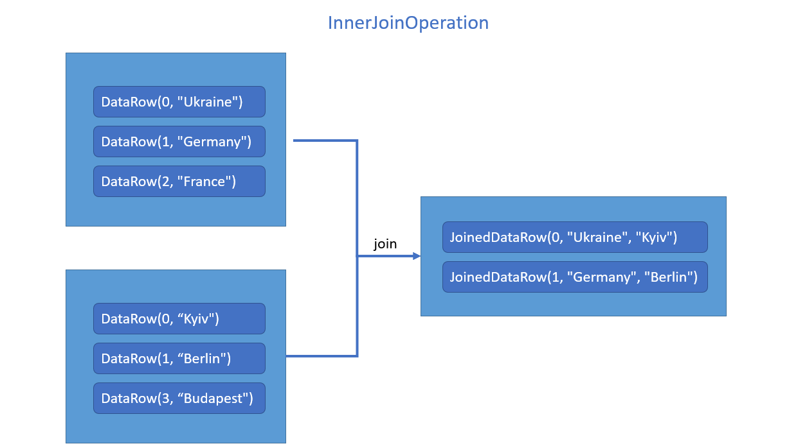
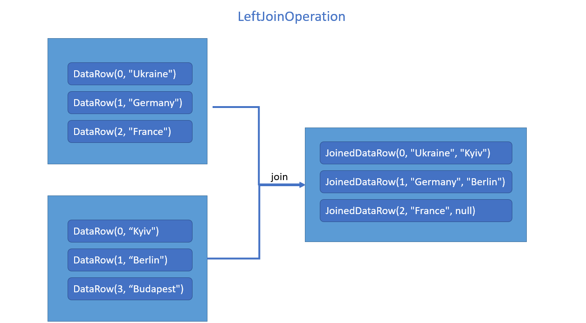

# Test tasks for Java/Scala Rocket Camp Intellias

### Me
* Name: Dzhos Oleksii
* Resume: [Link](https://docs.google.com/document/d/11rwk4GX7Hk_KxSSVhoITFynw3j7Io9Zecr3erBNIN0E/edit?usp=sharing)
* For start example in Task `mvn exec:java`
* For test: `mvn test` 

### Test project requirements

1) Project should be built with Java 1.8+
2) Hints: use maven.compiler.source and maven.compiler.target properties to set version
3) Code should be properly formatted according to the Java code conventions
4) Any other libraries and frameworks could be used
5) `mvn test` — should run all tests, if tests are presented in the project
6) Hint: do not forget about maven-surefire-plugin to run the tests
7) `mvn exec:java` — should execute project's Main method, if any exists
8) The project execution should be in two commands: `git clone ...`, `mvn ...`
9) Any configurations and resources should be bundled in the git repository or maven `pom.xml`

### Task

Having **JoinOperation** interface, provide three implementations of this interface:
```
public interface JoinOperation<D1, D2, R>{
    Collection<R> join(Collection<D1> leftCollection, Collection<D2> rightCollection);
}
```
1) InnerJoinOperation
2) LeftJoinOperation
3) RightJoinOperation

* D1 - is a generic type of the elements in left collection
* D2 - is a generic type of the elements in right collection
* R - is a generic type of the elements in resulting collection

For the InnerJoinOperation, LeftJoinOperation and RightJoinOperation create two classes that holds the data:
* DataRow<K, V>, where K is a generic type of the key, V is a generic type of the value. 
* JoinedDataRow<K, V1, V2>, where K is a generic type of the key, V1 and V2 are generic types of the values 
* For our task DataRow<K, V> is your D1/D2 and JoinedDataRow<K, V1, V2> is R in the implementation classes. 

**IMPORTANT: Do not change JoinOperation interface!**

So, the signature in the InnerJoinOperation, LeftJoinOperation and RightJoinOperation should look like next:
* Collection<JoinedDataRow<K, V1, V2>> join(Collection<DataRow<K, V1>> leftCollection, Collection<DataRow<K, V2>> rightCollection);

Join should be performed by key: K

**From algorithm point of view:**
* For simplicity we can say there is no duplicated keys in each separate collection.
* Hint: start with simple approach and then think about optimizations.
* Create JUnit tests for all implementations.
* Junit test should be executed by mvn test command

### Example
```
    leftCollection = [DataRow(0, "Ukraine"), DataRow(1, "German"), DataRow(2, "France")]
    rightCollection = [DataRow(0, "Kyiv"), DataRow(1, "Berlin"), DataRow(3, "Budapest")]
```
* InnerJoinOperation.join gives: [JoinedDataRow(0, "Ukraine", "Kyiv"), JoinedDataRow(1, "Germany", "Berlin")]
* LeftJoinOperation.join gives: [JoinedDataRow(0, "Ukraine", "Kyiv"), JoinedDataRow(1, "Germany", "Berlin"), JoinedDataRow(2, "France", null)]
* RightJoinOperation.join gives: [JoinedDataRow(0, "Ukraine", "Kyiv"), JoinedDataRow(1, "Germany", "Berlin"), JoinedDataRow(3, null, "Budapest")]
* **Pay attention on the order of the K, V1, V2 in the resulting set.**





**Additional hints:**

* You need simple understanding of Java Generics to complete this task.
* You might notice that join operation is similar to SQL join operations. Yes, that's true, recall SQL it might help you to resolve the task!
* Do not forget to test corner cases in your JUnit tests.
* If you are stuck just make an assumption and implement the task based on it. Later we can discuss this on interview.
